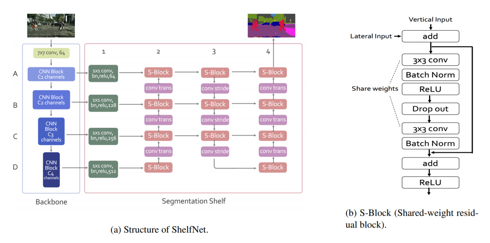

# Fast accurate Human Pose Estimation using ShelfNet with PyTorch

This repository is the result of my curiosity to find out whether ShelfNet is an efficient CNN architecture for computer vision tasks other than semantic segmentation, and more specifically for the human pose estimation task. The answer is a clear yes, with 74.6 mAP and 127 FPS on the MS COCO keypoints task which represents a 3.5x boost in FPS with an accuracy similar to HRNet. 

This repository includes:

* Source code of ShelfNet modified from the authors' [repository](https://github.com/juntang-zhuang/ShelfNet/tree/pascal)

* Code to prepare the MS COCO keypoints dataset

* Training and evaluation code for MS COCO keypoints modified from the HRNet authors' [repository](https://github.com/HRNet/HRNet-Human-Pose-Estimation)

* Pre-trained weights for ShelfNet50

If you use it in your projects, please consider citing this repository (bibtex below).

 
## ShelfNet Architecture Overview

The ShelfNet architecture was introduced by J. Zhuang, J. Yang, L. Gu and N. Dvornek through a paper available on [arXiv](https://arxiv.org/abs/1811.11254). The paper evaluates the network only on the semantic segmentation task. The authors' contribution is to have created a fast architecture with a performance similar to the state of the art (PSPNet & EncNet at the time of publishing this repository) on **PASCAL VOC** and better performance on **Cityscapes**. Therefore, ShelfNet is presently one of the most suitable architectures for real-world applications with resource constraints.



As depicted above, ShelfNet uses a ResNet backbone combined with 2 encoder/decoder branches. The first encoder (in green?) reduces channel complexity by a factor 4 for faster inference speed. The S-block is a residual block with shared-weights to significantly reduce the number of parameters. The network uses strided convolutions for down-sampling and transpose convolutions for up-sampling. The structure can be seen as an ensemble of [FCN](https://github.com/fmahoudeau/fcn) where the information flows through many different paths, resulting in increased accuracy.


## Results on Microsoft COCO KeyPoints

This section reports test results for ShelfNet50 on the famous [MS COCO KeyPoints](http://cocodataset.org/#keypoints-2019) dataset, and makes a comparison with the state of the art HRNet. All experiments use the same person detector with a mAP of 0.56. A single Titan RTX with 24GB RAM was used. The batch size for ShelfNet50 is 128 for an input size of 256x192 and 72 for 384x288.


| Architecture            | Input size  | Parameters  |    AP   |    AR   | Memory size |   FPS   |
|-------------------------|-------------|-------------|---------|---------|-------------|---------|
| pose_hrnet_w32          | 256x192     | 28.5M       |  0.744  |  0.798  |   931 MB    |   37.4  |
| pose_hrnet_w32          | 384x288     | 28.5M       |  0.758  |  0.809  |   957 MB    |   37.6  |
| pose_hrnet_w48          | 256x192     | 63.6M       |  0.751  |  0.804  |  1083 MB    |   37.7  |
| pose_hrnet_w48          | 384x288     | 63.6M       |  **0.763**  |  0.812  |  1103 MB    |   36.7  |
|-------------------------|-------------|-------------|---------|---------|-------------|---------|
| **shelfnet_50**             | 256x192     | 38.7M       |  0.725  |  0.782  |  1013 MB    |  127.3  |
| **shelfnet_50**             | 384x288     | 38.7M       |  0.746  |  0.797  |  1033 MB    |  **127.7**  |


## Training on Your Own

I'm providing pre-trained weights for ShelfNet50 to make it easier to start. The test accuracies are given without providing the ground truth bounding boxes at test time.

| Model                                                                                |    AP   |
|--------------------------------------------------------------------------------------|---------|
| [ShelfNet50_256x192](https://1drv.ms/u/s!AvyZUg7UPo_CgdN2S7I54mQD_bglow?e=ENRfVH)    |  0.725  |
| [ShelfNet50_384x288](https://1drv.ms/u/s!AvyZUg7UPo_CgdN3kXRSo4PrHcf8RQ?e=IscuxG)    |  0.746  |


You can train and evaluate directly from the command line as such:
```
# Train ShelfNet on COCO
python train.py --cfg coco/shelfnet/shelfnet50_384x288_adam_lr1e-3.yaml
```

```
# Test ShelfNet on COCO
python test.py --cfg coco/shelfnet/shelfnet50_384x288_adam_lr1e-3.yaml TEST.MODEL_FILE ../output/coco/shelfnet/shelf_384x288_adam_lr1e-3/model_best.pth TEST.USE_GT_BBOX False
| Arch       | AP    | Ap .5 | AP .75| AP (M)| AP (L)| AR    | AR .5 | AR .75| AR (M)| AR (L)|
|------------|-------|-------|-------|-------|-------|-------|-------|-------|-------|-------|
| shelfnet   | 0.746 | 0.901 | 0.814 | 0.706 | 0.818 | 0.797 | 0.938 | 0.858 | 0.752 | 0.862 |
```

## Requirements

Python 3.7, Torch 1.3.1 or greater, requests, tqdm, yacs, json_tricks, and pycocotools.
Contrary to the ShelfNet repository, this repository is not based on torch-encoding.


## Citation

Use this bibtex to cite this repository:
```
@misc{fmahoudeau_shelfnet_human_pose_2020,
  title={ShelfNet for Human Pose Estimation},
  author={Florent Mahoudeau},
  year={2020},
  publisher={GitHub},
  journal={GitHub repository},
  howpublished={\url{https://github.com/fmahoudeau/ShelfNet-Human-Pose-Estimation}},
}
